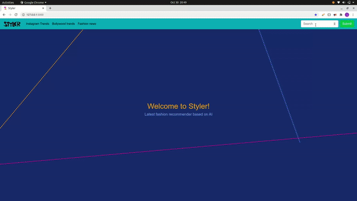

<br />
<p align="center">
  

  <h3 align="center">Your Personal Fashion Advisor</h3>
</p>

# Table of Contents

* [The Problem Statement](#the-problem-statement)
* [Our Proposed Solution](#our-proposed-solution)
  * [The Idea](#the-idea)
  * [Datasets Used](#datasets-used)
  * [How Does It work](#how-does-it-work)
  * [Built With](#built-with)
  * [How to run](#how-to-run)
* [impact and Influence](#impact-and-influence)
* [Contributing](#contributing)
* [Contact](#contact)

## The Problem Statement

### Ever thought what to wear ?

We generally find it difficult to get to know about the latest trending fashion which is going on in the world for both the Technology and Fashion are rapidly changing and if we fail to keep up our pace with the change we would surely be left behind.

A big issue in finding the latest fashion trends is the reliability of the source as well as the authenticity of the same. We generally are swayed in wrong directions due to biasing of the source (by some famous brands to get their sales high) from where we are getting the information and other factors such as the  accuracy and being up to date.

## Our Proposed Solution

What we aim to do is to either build an integration for the current Myntra Platform or build a complete new software (both web based and mobile based) which would perform following tasks :

* DATA COLLECTION : Collect information from various brands websites as well as other models pages (using web scraping if allowed) which would give us a base for forming a chart for the latest trending fashions in all types of clothes.
* DATA CLEANING : Remove the unimportant and irrelevant information from the data using various pre-processing techniques and make it ready to be fed into the recommendation model.
* BUILDING THE MODEL : We would also use collaborative filtering methods to build a Recommendation System which would take into considerations the reviews and choices of the customers and rank the information collected accordingly.
(As of now we have used a custom dataset from Kaggle for building the initial system.)
* DESIGNING THE USER INTERFACE : We would also be giving a good percentage of importance to user feedback so as to make the platform fully user friendly and adaptable to any change in the trends.

### The Idea and the Workflow


Here the chart explains the overall working process of the app starting from AI model recommending dresses to user's based on their past preferences and the latest trends collected across various mediums and then providing the 3D view facility to the customer as well in UI.

### How Does It work



### Key Technologies :-

* Flask Framework and Selenium (Scrapping)			
* Building Recommendation System 
* Data Preprocessing -  Python :Sklearn (numeric) and NLTK(text) 
* Collaborative Filtering - Python :Scipy (numeric),Spcay(text) and Keras API
* AI ( Deep Learning Models) - Python : Tensorflow, Keras, Pandas and Numpy 


### How to run

1. Clone the repo

```sh
git clone https://github.com/Preetesh21/DanglingPointers
```

2. Install the required packages 

```sh
pip install -r requirements.txt
```

3. Go to the project directory

```sh
cd DanglingPointers
```

4. Run the web app

```sh
python app.py
```

5. Enjoy!

### Impact

* #### On E-Commerce business 

Driving forces behind E commerce are Global Customers – Presence of customers of a product worldwide and Global Products – Demand for foriegn products by customers and the most important themes to bind them together and to make the customers buy the product is the trendiness of the product and the ability to recommend the same to the customer at the correct time. As such our proposed solution aims to achieve the same and boost the business. Moreover, Our new proposed idea of ‘3D try on’ will increase the trust of people towards Online shopping.

* #### On Youth

 We as a youth, are very conscious about our dressing sense and we always try to look nice and up to date with latest fashion. As we always try to copy celeb’s fashion trends, Styler will make our life easy by recommending us what trend we need to follow in no time. 

## Contributing

Contributions are what make the open source community such an amazing place to be learn, inspire, and create. Any contributions you make are **greatly appreciated**.

1. Fork the Project
2. Create your Feature Branch (`git checkout -b feature/AmazingFeature`)
3. Commit your Changes (`git commit -m 'Add some AmazingFeature'`)
4. Push to the Branch (`git push origin feature/AmazingFeature`)
5. Open a Pull Request

## Contact

Team DanglingPointers - [Garima Soni](mailto:2018csb1089@iitrpr.ac.in?subject=[GitHub]%20Source%20Han%20Sans) and [Preetesh Verma](mailto:2018eeb1171@iitrpr.ac.in?subject=[GitHub]%20Source%20Han%20Sans) 
